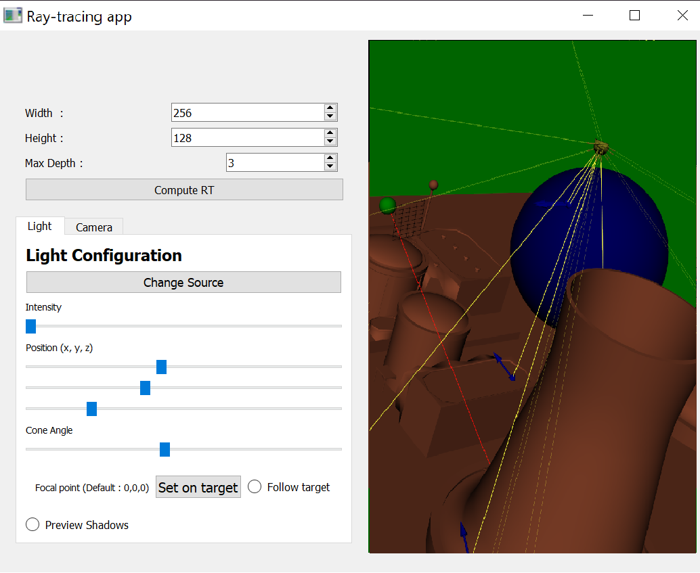

<!--  -->


# Visu raytracing
Scientific data visualisation project.
Using online and offline rendering modes with vtraytracing.

This documents contains the presentation of our work on implementing a
RayTracing algorithm using the VTK library and Python's bindings.

First, we are going to do a brief sate of the art on raytracing, then we will
explain our implementation logic and technical choices. To conclude, we will
show some images rendered by our application.

# Running the code
You can use the `environment.yml` file to setup your Python environment with
conda.

## Required librairies
numpy
matplotlib
vtk9
pyQt5
tqdm (to display progress bar)

To run the app, just launch the `main.py` file and let the UI guide you !


# Brief state of the art
Ray tracing was first introduced in 1980 by Turner Whitted in his paper on
[An Improved Illumination Model for Shaded Display](https://www.cs.drexel.edu/~david/Classes/Papers/p343-whitted.pdf)

This is one of the picture presented in T. Whitted's paper, the rendering time **74 minutes**.

<!--  -->


Since then, a few methods of ray tracing have emmerged, and our hardware too,
gains in computational power every year. Now, we are able to compute raytracing
in real time with GPU accelerators.

Here is the different methods that have emmerged since the first paper on the
ray-tracing algorithm :
- **Path Tracing** : Ray tracing but with only 1 random ray bouncing, then
sample (average) a certain amount of them
- **Bidirectionnal Path Tracing** : From camera to objects and from light source
to objects. Less variance of the result in complicated bouncing scenarios
- **Volumetric Path Tracing** : Samples a distance before an object is touched,
and scatters the light at this point (used to render fog, fire, particles...)
- **Metropolis Light Transport** : BDPT but the sampling is not totally random,
it explores nearby light paths with as the metropolis algorithm explores
distributions
- **Photon Mapping** : Used a lot for caustics, reflection, interreflection and
translucent surfaces

In this program, we used the **path tracing** method to compute our offline
rendering.

# Implementation Logic & Method
## Python's VTK bindings
For VTK, we decided to give a try to the [Python's vtk library](https://pypi.org/project/vtk/).
This librairy is nothing more than bindings to the original VTK library. Hence,
the documentation is exactly the same and we could use VTK just like we would
have done with a compiled language.

## User Interface : Qt & Qt Designer
We decided to use Qt (with either PySide or PyQt as a python wrapper) for the
User interface, this way, we don't have to make complex documentation about what
keyboard shortcut to use to interact with our VTK panel.

<!--  -->


To build the UI we used [Qt Designer](https://doc.qt.io/qt-5/qtdesigner-manual.html),
which generates a `.ui` file. This file is compiled at the start of our
program into a `.py` python file which is the corresponding Qt Windows, with all
sizes and objects' labels automatically set. We do not have to touch this file
once it is generated. This method allowed us to make a more complex UI to give
the user more interaction with our VTK environment.

In the code, we had to make a binding between the QtWidgets' methods (e.g.,
`ValueChanged` for a Slider) and Python functions that interacts directly with
our VTK actors and/or sources.

# Using the app
## Online rendering
Here, we tried to do a "real-time" ray tracing, we wanted to be able to see the
ray castings from the sun and hitting a surface.

<!--  -->


Here is a list of what each Widget does :
- **Width/Height/Max Depth** : Ray-tracing options (image size, and depth of 
bouncing rays)
- **Compute RT button** : Used to launch the ray-tracing computation. This takes
a long time since we are in sequential python
- **Light Configuration** :
  - **Change source button** : This button sets the source of the light from
VTK renderer's [active camera](https://vtk.org/doc/nightly/html/classvtkRenderer.html#ab14d1aeb74a4990f2da819e09d028d65)
or from the sun ball displayed in the vtkView
  - **Sliders** : Each slider corresponds to parameters of the light (sun sphere
in our case)
  - **Focal point** : The **"Set on target"** button sets the focal point of the
light on the current "camera" position (the green sphere in our view). The
**Follow target** radio button makes the focal point of the light follow the
position of the "camera"
  - **Preview Shadows radio button** : This button turns on/off the
[VTK shadows of the current renderer](https://vtk.org/doc/nightly/html/classvtkRenderer.html#af9e8d4f6ef7154663f82f624c6a001a5).
Note that the sun's rays are not available in this mode.

## Offline rendering
To compute the ray tracing algorithm and get and output image, press the
**Compute RT** button. The rendering can take a long time depending on the size
of your image and the max depth you want.


The algorithm we used is based on different implementations we explored from the
community. Our final algorithm is :

```
Set the image of size (width, height) with black pixel
Get the "screen" position in the 3D space to get each pixel's position

For each pixel in the image :
    Cast a ray going from the camera that pass through the pixel's position
    If this ray hits an objetct :
        Get the intersection point
        If there is no obstacle between point and light source :
            If we reached MaxDepth :
                Set the pixel's color with the light's diffuse color
            Else :
                If the surface is reflective, recursion to get color's contribution from all the objects
        Else :
            The point is shadowed, set pixel's color black

    Else (no obstacle for the ray):
        Set the pixel's color with the object's ambient color

```

It is pretty basic, the hard part was managing VTK's framework since we had
never programmed with it. You can find the full method inside the `main.py` file
in the main rendering class, the method is `compute_RTX(self)`.

# Ameliorations
- Decoupling the main big class
- Parallelize the main RTX loop (maybe in another language)
- Add different sources of light
- Adding objets live
- Add different ray-tracing rendering methods
- Give the user more interactions
- ...

# Usefull websites
https://github.com/RayTracing/raytracing.github.io
https://pyscience.wordpress.com/2014/10/05/from-ray-casting-to-ray-tracing-with-python-and-vtk/
http://www.lama.univ-savoie.fr/pagesmembres/lachaud/Cours/INFO805/Tests/html/ig_tp2.html
https://medium.com/swlh/ray-tracing-from-scratch-in-python-41670e6a96f9
https://github.com/RichCartwright/Path-Tracing-Viz
